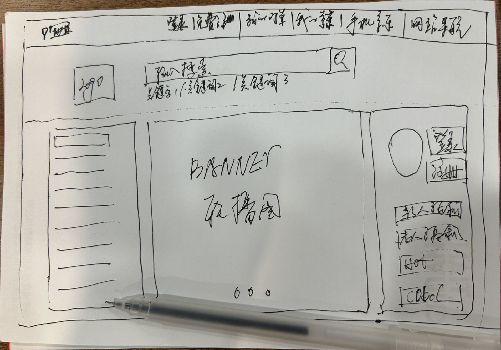
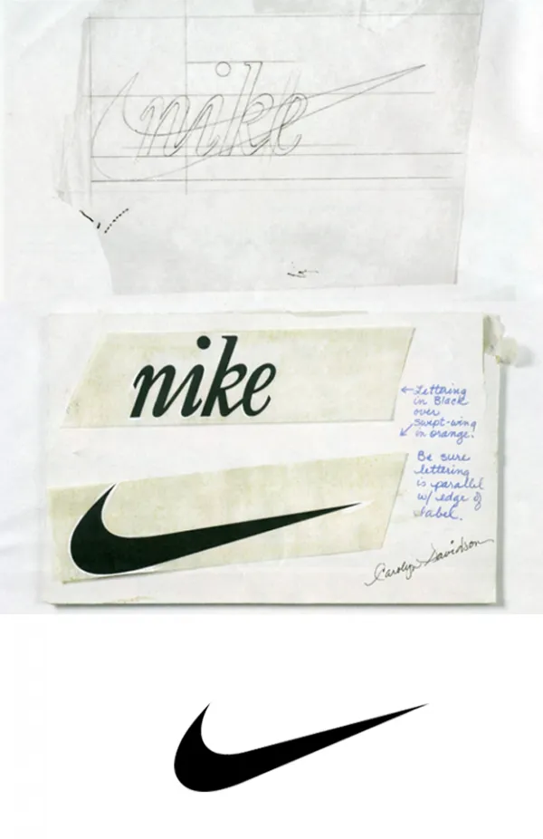
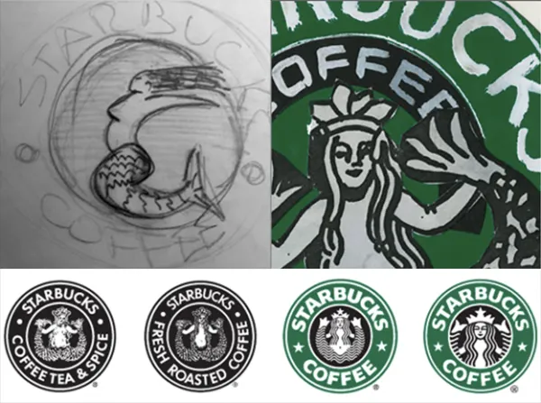

# 迷恋工具

——不要纠结工具，你要像高手一样去思考，武功心法非常重要。

> 神雕侠侣中杨过在绝情谷，就不用武器，凭一根树枝就打败众人，手中无剑，心中有剑。

你很可能现在要买什么配置的电脑，要苹果电脑，还是要其他的电脑，你想着要多少核数的CPU，多少G的电脑，能不能打英雄联盟。

*不要想那么多*

去动手吧，去看书吧，你可能还需要先追完这集电视剧，可能还得收拾赶紧桌子，重新摆放桌上的物品，然后充上一杯咖啡，时间可能已经过去30分钟，这时你可能还会去冲个咖啡，有模有样的，从第一步开始，打开电脑，打开软件，构思你的设计，根本就不需要这么多前置动作，你只要想动手就会有很多办法。

这是要做事，不是要施法，放技能前摇时间过长，你很难命中的。

还是在[前言](./README.md),通过一次简单的实践，只需要30分钟，你就会知道实践的力量，你只要略微出手。

对于新手而言，最重要的不是工具，*随便都可以，能干活就行*，假设你不会用软件，甚至你都可以用手画，重要的是能够动手实践起来，笔者在这里在手工绘制产品设计手稿，说来就来。

* 我就手画个京东电脑端

对，就这么朴素，画的也很潦草，但是结构位置，整体谁都看得懂，字有些潦草，没关系，这是手稿。

这时就有人会说，这一点技术含量都没有，没错，我这个是给新手的，这个就是基本入门，同时我也相信你要画的画，会画得比我好。

我在这里一直说要快速实践起来，等你实践之后，你就知道实践的力量，在手绘的过程中，不需要想太多，你只需要知道他的结构。

这是我一个10年+技术开发+产品经理+项目经理+软件架构+人事招聘这么个老鸟给你开的全图视角说明。

你不要觉得这个画的很丑，手稿一般都是自己内部看，在讨论的时候用的，在产品文档里面就有一句话，**一图胜千言**。

给大家先看两个例子，大家可以好好思考下我讲的对不对，如果你觉得我讲的不对，就不要继续往下阅读，因为往下阅读，我的个人私货就越多，越来越主观，如果有让你感觉到不适，请立即停止阅读。

* 耐克

Nike logo:Carolyn Davidson（通过印刷杂志）

最初的耐克logo是波特兰州立大学平面设计专业的学生卡罗琳·戴维森在1971年创造的，售价35美元。没有一个创始人对她最初设计的6个设计感兴趣，只是简单地选择了一个“最不糟糕的”。logo是标志性的，因为它是一个伟大的设计，还是因为公司的成功，有待商榷，但自从它被创造出来后就没什么变化,我个人就是认为商业的成功，他才变成一个伟大的设计。

* 星巴克

星巴克logo：特里·赫克勒

15世纪的挪威双尾美人鱼木刻是星巴克2011年的最初灵感来源。上图是设计师特里·赫克勒（Terry Heckler）最新logo的早期草图和水墨画，展示了它是如何演变成今天我们所知道的更现代的美人鱼的。

