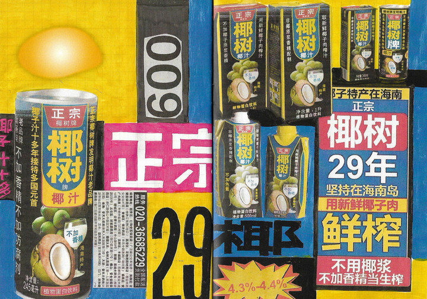

# 做好设计的思路

首先要先问什么是好的设计，抛开产品内容不谈的话，我个人的看法跟吃的一样

>食无定味，适口者珍

那我们也不能仅限于此，我们还是要按照常规的原则来思考此事

再问GPT，好的平面设计具有哪些特点和品质：
1. 清晰和易读性：好的平面设计应该具有清晰的信息传达和良好的可读性。文字应该清晰可辨，排版应合理，不会使人感到混乱或困惑。设计师应注意字体选择、字号、行间距和段落间距等因素，以确保信息的清晰传达。
2. 良好的组织结构：好的平面设计能够以逻辑和有条理的方式组织信息。设计师应合理布局元素，考虑内容的层次结构和重要性，并使用对齐、间距和分组等技巧来创建清晰、易于理解的设计。
3. 合适的色彩和配色方案：色彩在平面设计中起着重要的作用。好的设计应该运用合适的色彩和配色方案来传达情感、引起共鸣，并帮助信息的表达和区分。设计师应考虑色彩的对比度、互补性和情感联想，以创建视觉上令人愉悦和引人注目的设计。
4. 创意和独特性：好的平面设计应具备创意和独特性，能够引起观众的兴趣和注意力。设计师可以运用创新的布局、图形元素、插图、图标等来突破传统，展示个性和独特的设计风格。
5. 图形和图像的有效使用：平面设计通常使用图形、图像和插图来传达信息和增加视觉吸引力。好的设计师应该懂得选择合适的图形和图像，并在设计中有效地使用它们，以增强设计的表达力和视觉冲击力。
6. 品牌一致性：对于品牌设计来说，好的平面设计应该与品牌的形象和价值观保持一致。设计师需要熟悉品牌的风格指南，并将其应用到设计中，以确保品牌在不同媒体和平台上的一致性和识别性。
7. 可持续性：好的平面设计也应考虑可持续性的因素，例如选择环保的材料和印刷方式，减少浪费和能源消耗等，我国也有限制过度包装的要求，GB 23350-2021《限制商品过度包装要求》，于2023年9月1日实施，设计师应关注设计的生命周期和影响，努力创造可持续和环保的设计作品。

根据[万能公式](./CHAPTER.05.md)
以上这些，我们就找出必要的，首先抛开创意性和独特性，这个就交给专业的设计师弄，我自己也弄不明白，还有哪个可以弱化，那就是配色方案，你就是尽量不要弄三种以上的颜色，一般人也hold不住，再接下来，再去掉哪个，就是图形和图像的使用，当然有的是办法，就是用ai工具，但是我们还是先入门要紧，那就是先用简单的图形，三角形，矩形，椭圆形，五角星，主要常用的其实就一个矩形和线段，这么弄完就可以简单概括。

1.清晰的产品介绍（有一说一）
2.结构简单，主次分明，正常就三个层级，比如字体大中小
3.颜色简单，主色，浅色，辅助色
4.擅用简单图形，不懂用就用矩形，分个层次
5.品牌，就是logo印上

那么就回到[前言](./README.md)，你真的只需要花30min就可以入门做设计。

对，有人就说那个很土，那么好，土就是我的标签，我将开启我的泥石流设计旅程。

有个泥石流设计的代表，椰树牌椰汁。

