# 学了素描，停写了一段时间

> 从基础学起，了解了下构图

都是我自己的手画图，看起来都很拙略，但那又怎么样，我又不是要当画家，我只是想掌握一下画画的基本入门，从根源上掌握下构图的能力,不用纠结工具，拿起纸笔就可以画，我就用中性笔画。

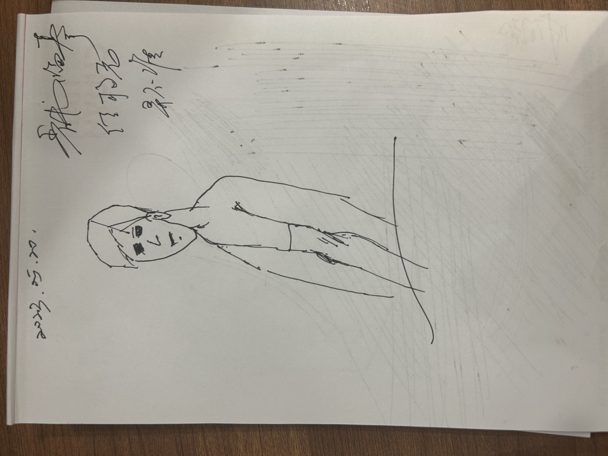

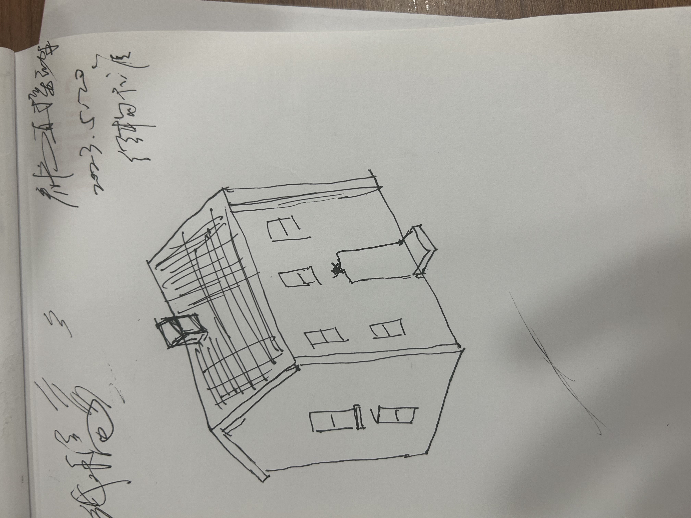

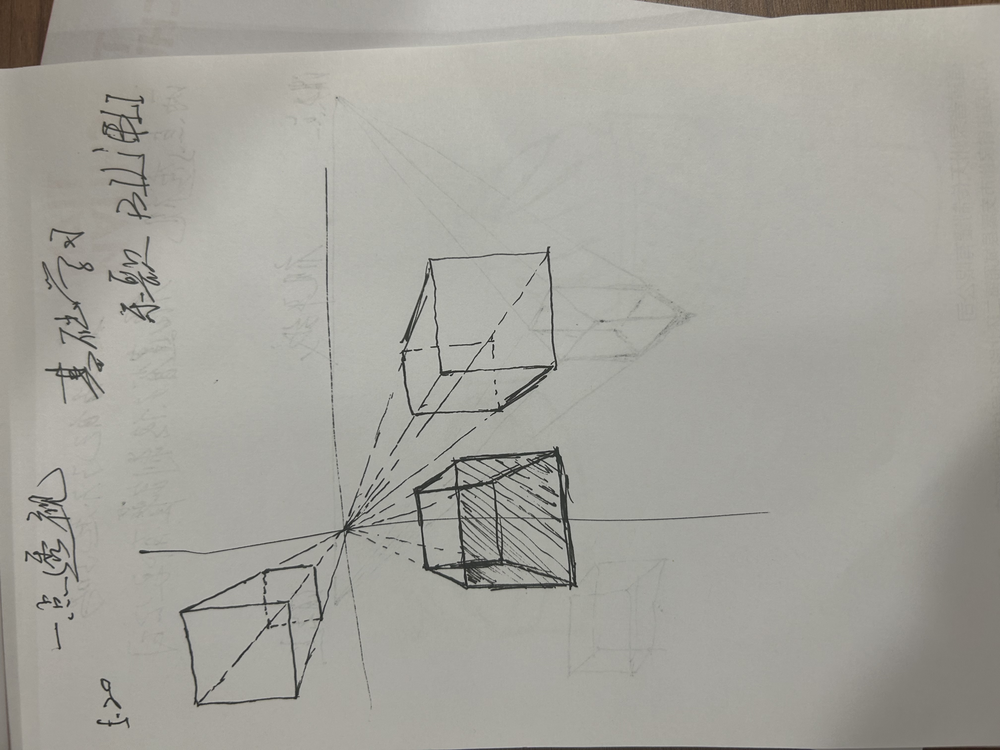

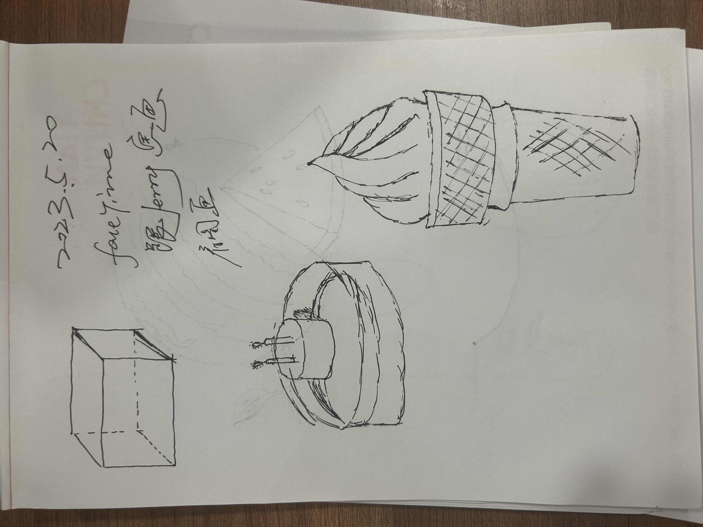

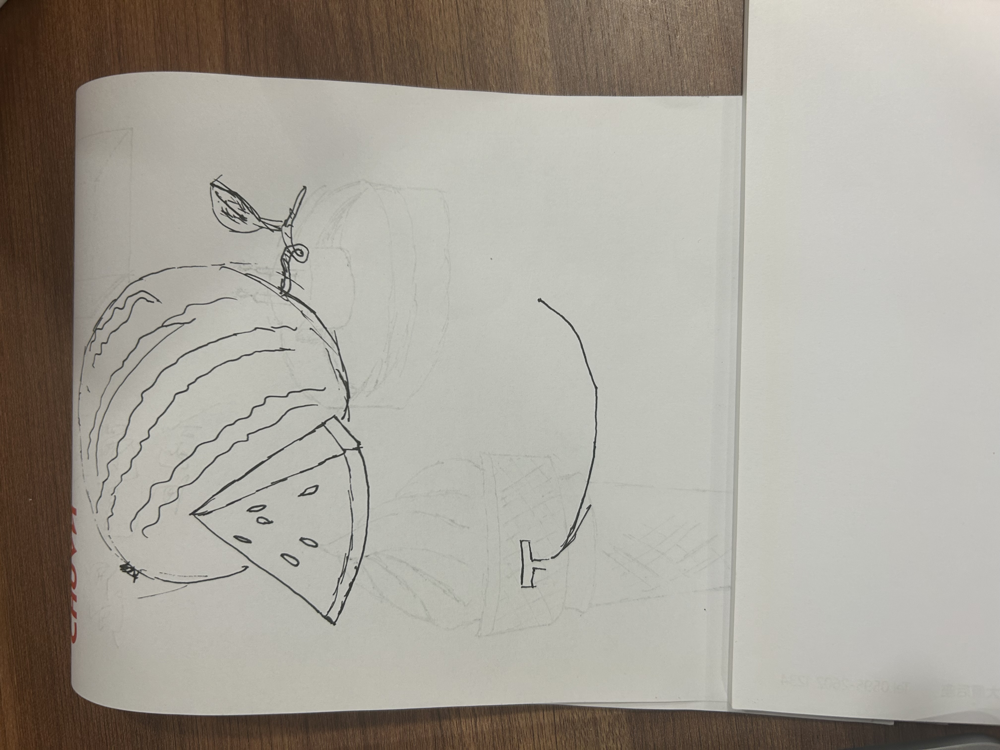

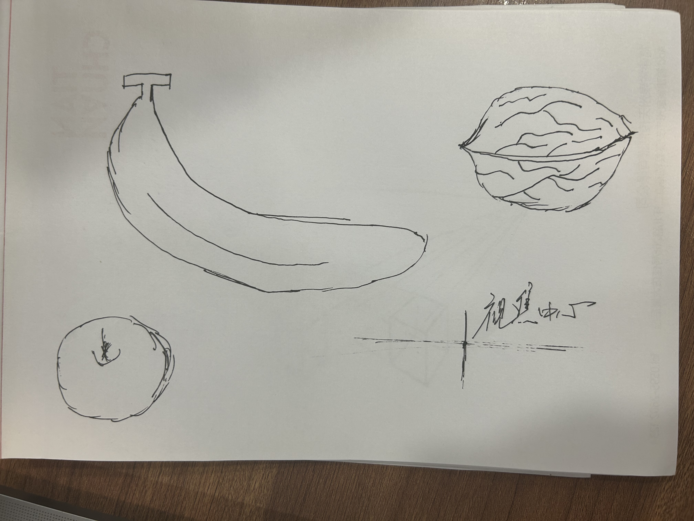

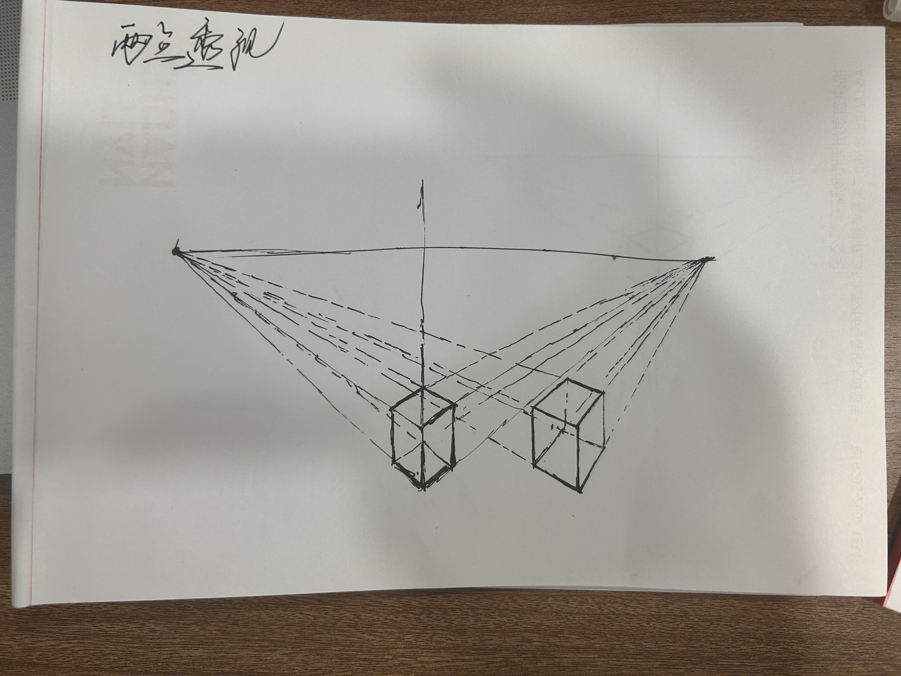

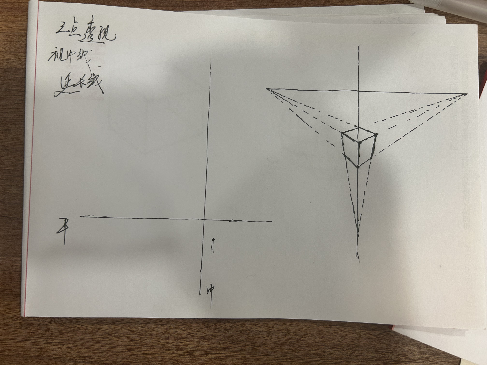

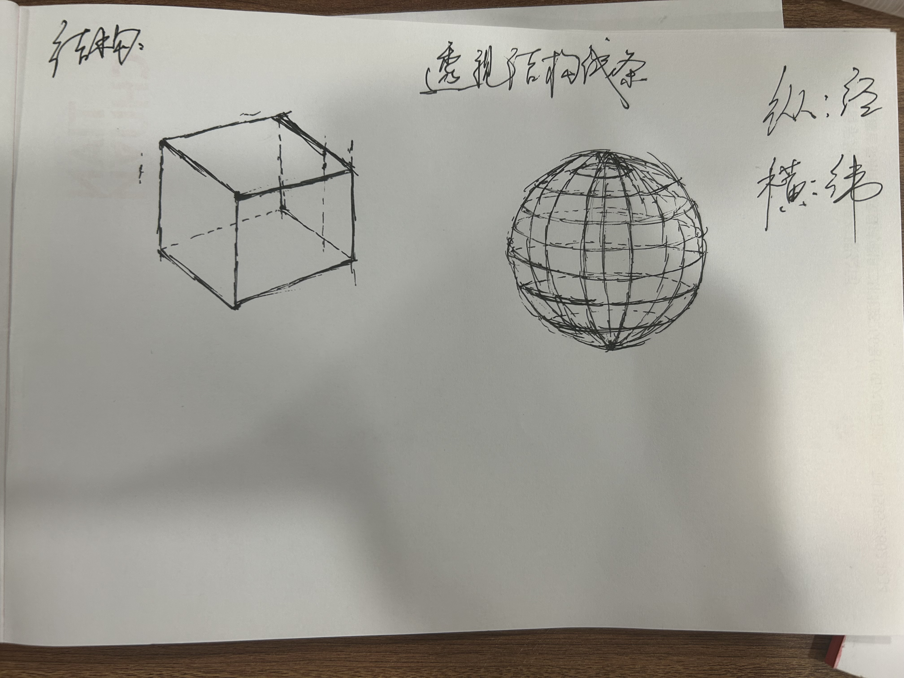

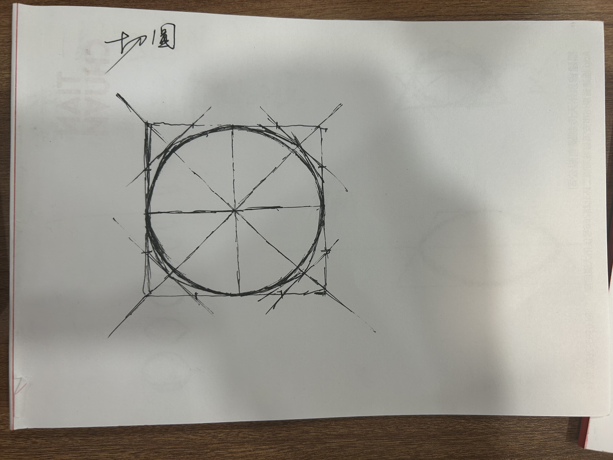

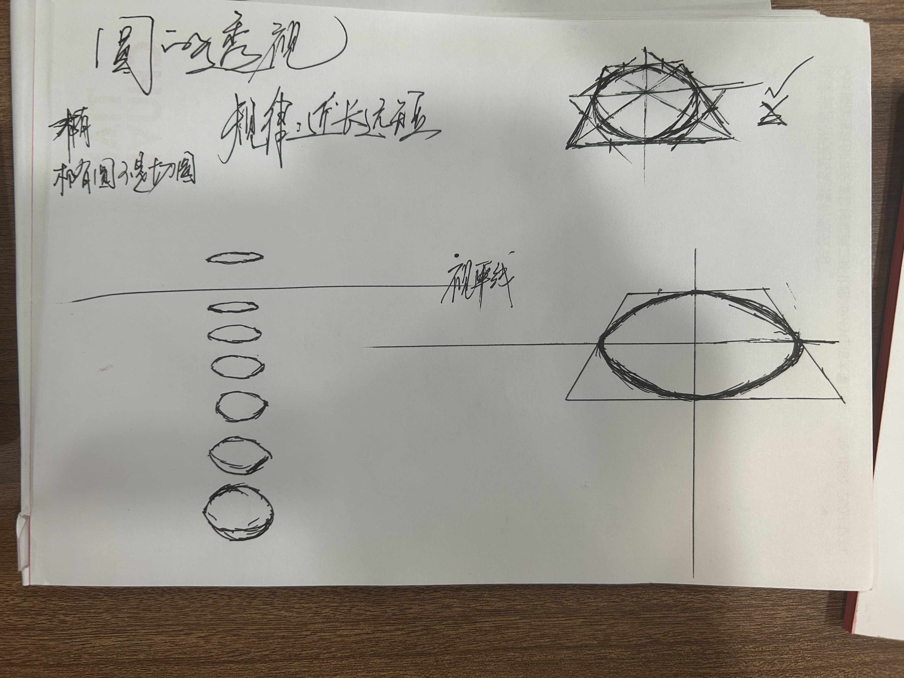

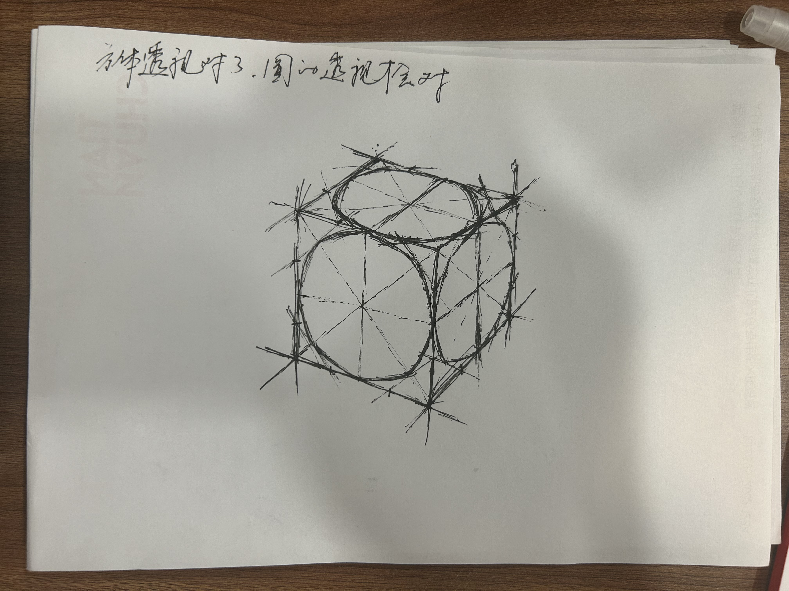

最近自己也在看AI绘画,还挺玩，关键词 ```pormpt```


> When the moon is full，Carp jumping over the dam， a carp, red fish, vertical up, jumping out of the water, simple background, Don't have red splashes，flat illustration, for packaging cover


> he symbol of perseverance and achievement: a koi fish leaping over the dragon gate


> ink wash painting ,Ancient Chinese poet, Li Bai, under the moon, alone, drinking a mug of beer


