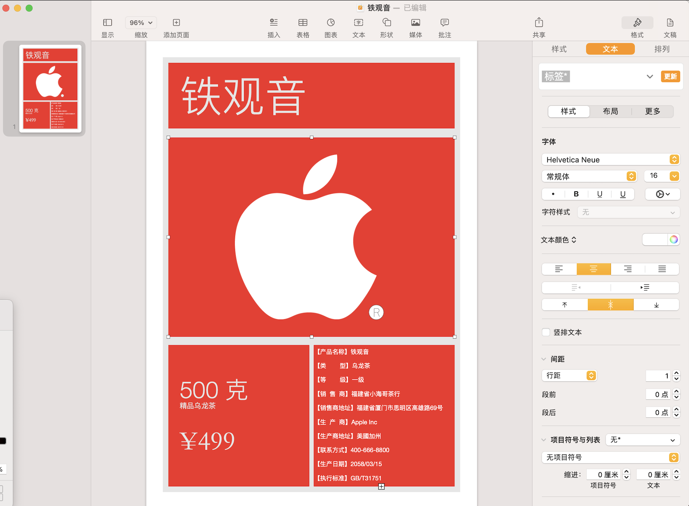

# 30分钟就能学会的设计

——*设计其实很简，有手就行*

> 只要三十分钟就可以做个平面设计，你真的只需要30分钟，就能学会。

我们直接就开始设计，啰里八嗦的先不说，跟写代码一样，先实现个hello world出来。

我用的工具是pages，mac上面的，windows可以用world
>  Anyone is ok,能干活就行
* 苹果公司联名铁观音海报 

*对，你30分钟就做这个，会这个就可以，接下来的东西你可能会觉得很很神奇，但都很简单就可以实现，那个平面设计29分钟*
* 根据这个海报，做个包装的设计图，纸桶圆罐的，直径156，高230，图纸宽500mm，高197mm

* 最后贴到3D上面展示

----
至此，30分钟，大概差不多，结束，这个过程真的很简单，很简单，你入门平面设计真的只需要29分钟，另外一分钟就可以做到3D上面，唯一问题就是你还不知道3D那个怎么弄，这个其实并不重要，重要的是你要学会平面设计，就第一步，剩下的一说就会。

> JUST DO IT ——NIKE

**实践出真知，纸上得来终觉浅**

我这边所书都是针对小白的内容，有高手的话，可以不用往下看，接下来的内容会比较啰嗦，作为笔者我，有我自己的经历，有自己的思路，讲的大部分是自己的心得，和自己的看法，对，有很多都是自己的看法，这不是一本适合老鸟看的书，这就是给小白看的，甚至是给非设计相关的人去阅读的一本书，笔能力有限，所书所写皆根据自己的见闻和日常实践而来。

声明，本人的言论仅代表我自己，同时也不指代任何人，任何公司。
笔者我先给自己立个FLAG，一定要写完这个设计入门的书，以前也写过一些其他系列的东西，但都无疾而终。希望这次不一样。  
**小海哥**  
2023年5月17日，于安溪

## 目录
### [前言](./README.md)

1. [我是谁](./CHAPTER.01.md)
2. [我也可以做产品经理](./CHAPTER.02.md)
3. [本书该如何阅读，你需要避开哪些坑](./CHAPTER.03.0.md)
    - 3.1. [完美主义](./CHAPTER.03.1.md)
    - 3.2. [迷恋工具](./CHAPTER.03.2.md)
    - 3.3. [做个理论家](./CHAPTER.03.3.md)
    - 3.4. [技术崇拜](./CHAPTER.03.4.md)
    - 3.5. [做个评论家](./CHAPTER.03.5.md)
    - 3.6. [在意别人的评论](./CHAPTER.03.6.md)
    - 3.7. [自我否定](./CHAPTER.03.7.md)
4. [让人眼前一亮的设计是个伪命题](./CHAPTER.04.md)
5. [送你一个万能公式](./CHAPTER.05.md)
6. [我就是初学者](./CHAPTER.06.md)
7. [做好设计的思路](./CHAPTER.07.md)
8. [零基础学素描，零基础学AI绘画](./CHAPTER.08.md)
9. [AI面前，人人平等](./CHAPTER.09.md)
10. [提问的技巧](./CHAPTER.10.md)
[结语](Finale.md)

实践出真知

知行合一

大道至简

